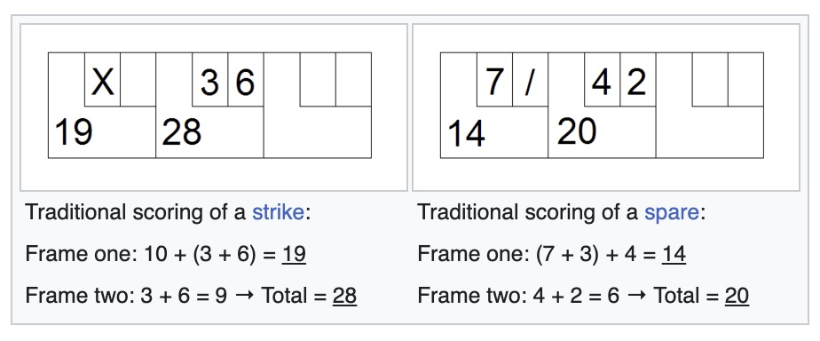

# Requirements

## The Game of Ten-Pins Bowling
Here's a reminder of the rules of bowling ([source](https://bowlingforbeginners.com/bowling-rules/)):

- The ultimate goal is to knock down all ten pins on your first turn.
- During each frame, each player gets two attempts to knock down all ten pins.
- Turns are called “frames,” and each player plays ten frames in a game.
- Knocking down all the pins on your first throw is called a strike.
- If you miss at least one pin on the first throw and then knock down any remaining pins on your second throw, it’s called a spare.
- If a player bowls a strike in the tenth frame, they get two more throws within that frame. If they get a spare in the final frame, the player gets to throw one more ball.
- Open frames are simply frames that left at least one pin standing.
- Scoring is based on the number of pins knocked down. Except, when you get a spare, you get 10 plus the number of pins you knock down during your next throw. If you get a strike, you get 10 plus the number of pins you knock down with your next two throws.

Here's an example of score ([source](https://en.wikipedia.org/wiki/Ten-pin_bowling)):

  

## The Program
Our task will be to write a program which, given a series of rolls delivered by Ten Pin Bowling players, computes the scores of these players. The roll values will be consistent with the game rules: no illegal values (such as -1, 11 or values totaling more than 10 in a frame). In test cases where not all rolls have been played, the resulting value should be the score obtained as if all the subsequent future rolls would be zero.

Our program's task will consist in reading the standard input stream, parsing the given numbers, computing and printing the scores. 

### Input specification

- _T_ : the number of test cases, then _T_ test cases follows.
- each test case consists in 2 lines:
  - _N_ : the number of rolls delivered, ( 0 < N ≤ 21 )
  - _R1,..Rn_ - the rolls delivered ( 0 ≤ R ≤ 10 )

### Output specification
For each test case output one integer: the score made by the player after they played all the rolls in the test case.

### Example

__Input:__

    3
    2
    4 6
    4
    10 7 3 5
    12
    10 10 10 10 10 10 10 10 10 10 10 10

__Output:__

    10
    40
    300
